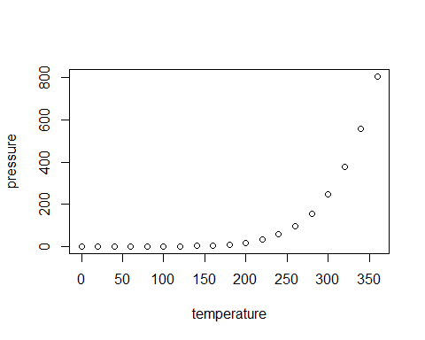

## R Markdown

 Let $y_{i,j} = \beta +\gamma_i +\epsilon_{i,j}$ for  $i= 1, \ldots T, $ and $ j=1\ldots B$. Here the  $\gamma_i$ is independent $N(0,\sigma_{\gamma}^2)$ and the $ \epsilon_{i,j}$'s are independent $N(0, \sigma_{\epsilon}^2)$, and the $\gamma_i$s and  the $e_{i,j}$s are independent. Here we assume $\esig$ and $\gsig$ are unknown and required to be estimated.

Represent the above model in terms of the standard matrix  form of the mixed linear model :
$\HLTEQ[lightBlueThree]{\bY=\bX\bbeta+\bZ \HLTEQ[orange]{\gammabf}+\HLTEQ[lightBlueOne]{\epsilonbf}}$
Specify 1) $\bX$, $\bY$, $\bZ$, $\gammabf$, $\epsilonbf$


```r
summary(cars)
```

```
##      speed           dist       
##  Min.   : 4.0   Min.   :  2.00  
##  1st Qu.:12.0   1st Qu.: 26.00  
##  Median :15.0   Median : 36.00  
##  Mean   :15.4   Mean   : 42.98  
##  3rd Qu.:19.0   3rd Qu.: 56.00  
##  Max.   :25.0   Max.   :120.00
```

## Including Plots

You can also embed plots, for example:

<!-- -->

Note that the `echo = FALSE` parameter was added to the code chunk to prevent printing of the R code that generated the plot.
